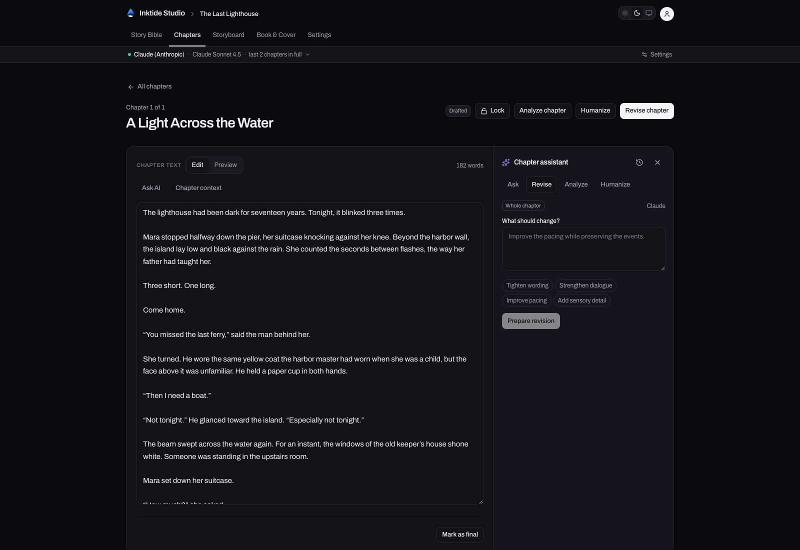
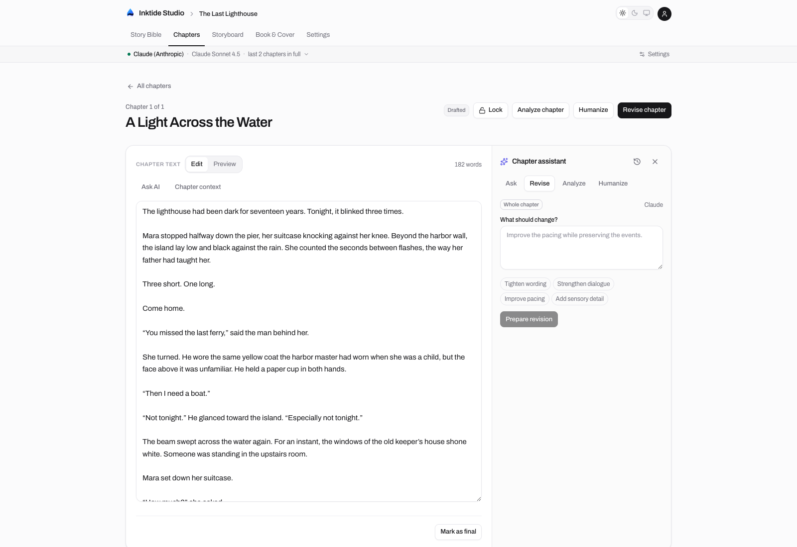

<p align="center">
  
</p>

<h1 align="center">Inkshore Studio</h1>

<h3 align="center">Your story. Your voice. A little help with the next draft.</h3>

<p align="center">
  Plan your world, write your chapters, and revise with AI—all in one desktop workspace.
  <br />
  Your library lives on your computer. No account needed to start writing.
</p>

<p align="center">
  <a href="https://github.com/AashishKumar-3002/inkdrop-studio/releases"><strong>Download Inkshore Studio</strong></a> ·
  <a href="#start-writing">Start writing</a> ·
  <a href="https://github.com/AashishKumar-3002/inkdrop-studio/issues">Share feedback</a>
</p>



A paragraph feels flat. A conversation needs tension. You're not sure whether
that opening chapter works. Inkshore gives you a place to work through it:
select a passage and ask for help, get an evidence-backed chapter critique,
or prepare a rewrite that you review before it touches your draft.

Keep your characters, world, and plot beside your manuscript. Bring the chapters
you've already written, draft something new, and export your book when it's ready.
Use your own AI API keys or your local Claude / Codex subscription sign-in on desktop.

**Write first, use AI when you need it.** You decide what changes to keep, with
saved originals to return to.

> **Early preview · 0.1.0** — Installer builds target macOS, Windows, and Linux.
> Downloads become available when the release is published. You can also
> [run from source](#running-from-source).

## Features

- **Story bible** — plan characters, setting, plot, and voice. Import existing
  notes from Markdown or text files.
- **Chapter editor** — write, import, or generate chapters with story context.
  Lock finished chapters and switch between editing and preview.
- **Chapter assistant** — ask about a selected passage, prepare a revision, or
  humanize prose. Review proposed changes before applying them and restore
  saved originals.
- **Editorial analysis** — get five equally weighted scores and an overall
  score out of 100, with evidence and suggested improvements. Scores are
  subjective editorial guidance.
- **Storyboard** — arrange notes and sketch ideas on a freeform canvas.
- **Book and cover** — set manuscript details, generate cover art, and export
  Markdown, PDF, or EPUB.
- **AI activity** — see which task is running while generation is in progress.
- **Local library** — the desktop app includes its own database; no PostgreSQL
  installation is needed.

### Prefer a brighter workspace?

Switch between light, dark, and your system theme.



## Desktop

Find published installers on the [Releases page](https://github.com/AashishKumar-3002/inkdrop-studio/releases).

| Platform | Architecture | Installer |
| --- | --- | --- |
| macOS | Apple Silicon, Intel | `.dmg` |
| Windows | x64 | `.exe` |
| Linux | x64 | `.AppImage`, `.deb` |

The app bundles its server and database. Node.js is not required to run a
packaged installer. Current builds are unsigned, so macOS Gatekeeper and
Windows SmartScreen may warn or block installation. Automatic updates are
not available yet.

### AI providers

Choose a provider in your project's **Settings**.

| Provider | Authentication | Availability |
| --- | --- | --- |
| Anthropic Claude | API key | Desktop and web |
| OpenAI | API key | Desktop and web |
| OpenRouter | API key | Desktop and web |
| NVIDIA NIM | API key | Desktop and web |
| Claude subscription | Local Claude sign-in | Desktop only |
| Codex subscription | Local Codex / ChatGPT sign-in | Desktop only |

Subscription providers use the account signed in on your computer and count
against its usage limits. Follow the sign-in instructions in Settings. These
modes currently support text only; sketches need a vision-capable API provider,
and cover generation needs an OpenAI API key.

AI generation requires a connection to the selected provider. Local storage
does not mean that text sent for AI processing stays on your device.

## Start writing

1. Open Inkshore Studio and create a project. You can rename it by double-clicking
   its name in the header.
2. Fill in your story bible, or import the notes you already have.
3. Add a chapter by writing, pasting, or uploading an existing draft.
4. To use AI, choose your provider and authentication method in **Settings**.
5. Select a passage to ask a question or prepare a revision. Use **Analyze** for
   feedback on the whole chapter, and review changes before applying them.
6. Export a chapter or your manuscript when you're ready.

You can write and organize your desktop library without an AI provider. AI is
optional; it is required only for generation, analysis, and other AI actions.

## Feedback and issues

Found a bug, confusing interaction, or something missing from your writing
workflow? [Open an issue](https://github.com/AashishKumar-3002/inkdrop-studio/issues).
Include your app version and operating system; steps or screenshots help with
bugs. Please leave out private manuscript text, API keys, and account details.

## Running from source

Use **Node.js 22** and npm. CI uses Node.js 22 as well.

```bash
git clone https://github.com/AashishKumar-3002/inkdrop-studio.git
cd inkdrop-studio
npm ci
npm ci --prefix desktop
```

### Run the desktop app

```bash
npm run desktop
```

This builds the app and opens Electron. The desktop shell creates its local
library and secrets automatically; no account or database configuration is
required. The initial build can take a few minutes.

After making changes, run the same command to rebuild. To reopen the existing
build without rebuilding:

```bash
npm --prefix desktop start
```

### Run the web app

The web app uses PostgreSQL and account-based access.

1. Create a PostgreSQL database.
2. Copy `.env.example` to `.env.local` and set `DATABASE_URL`.
3. Generate an `AUTH_SECRET` with `openssl rand -base64 32` and an
   `ENCRYPTION_KEY` with `openssl rand -hex 32`. Paste the values into `.env.local`.
4. Apply migrations and start the dev server:

```bash
npm run db:migrate
npm run dev
```

Open [localhost:3000](http://localhost:3000). API keys can be set per project in
Settings. Optional instance-wide keys and OAuth settings are documented in
[.env.example](.env.example).

Back up existing databases before applying migrations. Desktop migrations run
automatically at startup; web database migrations are managed separately.

### Checks

```bash
npm run typecheck
npx eslint src scripts tests
npm test
npm run build
```

For changes to desktop startup or packaging:

```bash
npm run desktop:prepare
node scripts/smoke-desktop.mjs
```

See [desktop release documentation](docs/releases.md) for installer builds,
version tags, draft releases, and icon exports.

## Built with

Next.js 16, React, TypeScript, Tailwind CSS, Electron, Drizzle ORM, and Auth.js.
Desktop storage uses PGlite; the web app uses PostgreSQL.

```text
src/app/          Pages and API routes
src/components/   Shared UI
src/lib/          AI providers, storage, authentication, and exports
desktop/          Electron shell and installer configuration
drizzle/          Database migrations
tests/            Automated tests
scripts/          Build, migration, and smoke-check tools
```

## Roadmap

- Sync between devices and accounts.
- Android and iOS apps.
- Signed installers and automatic updates.
- Hosted credits, subscriptions, and usage metering.

These are planned features, not currently supported. Libraries do not sync
between devices, and there is no real-time collaboration.

## Contributing

Issues and feedback are welcome. Small, focused fixes and documentation
improvements are welcome too; there is no expectation that users contribute
code. Please discuss larger features in an issue before starting a pull request.
See [CONTRIBUTING.md](CONTRIBUTING.md) for the short contributor guide.

## License

Licensed under the [MIT License](LICENSE). Copyright © 2026 Aashish Kumar.
